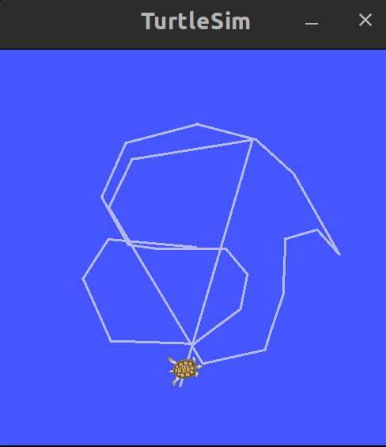

# Running ROS1 applications on Docker


## Prerequisites
- Docker is installed on your system. If not, please follow the [Docker installation guide](https://docs.docker.com/engine/installation/).

- You have a ROS1 application that you want to run on Docker. Otherwise to test if its working you can try using the `turtlesim` example from ROS


## Build the Docker image
- Build the Dockerfile that is in this repository. This will create a Docker image with the name `ros1_docker` and the tag `latest`. You can change the name and tag as you wish.
- You can build using the following command:

```bash
    docker build -t ros_app:latest .
```
- Alternatively you can pull the latest image from Docker Hub using the following command:

```bash
    docker pull farizkesten/ros1_app
```


## Run ROS1 application on Docker
Once you have the Docker image, you can run it by running `ros1.bash` script.

To test if everything works run the `roscore` and `turtlesim` nodes. You should get a window with the turtlesim application.

```bash
    roscore &
    rosrun turtlesim turtlesim_node
    # run in a new terminal to control the turtle
    rosrun turtlesim turtle_teleop_key
```


